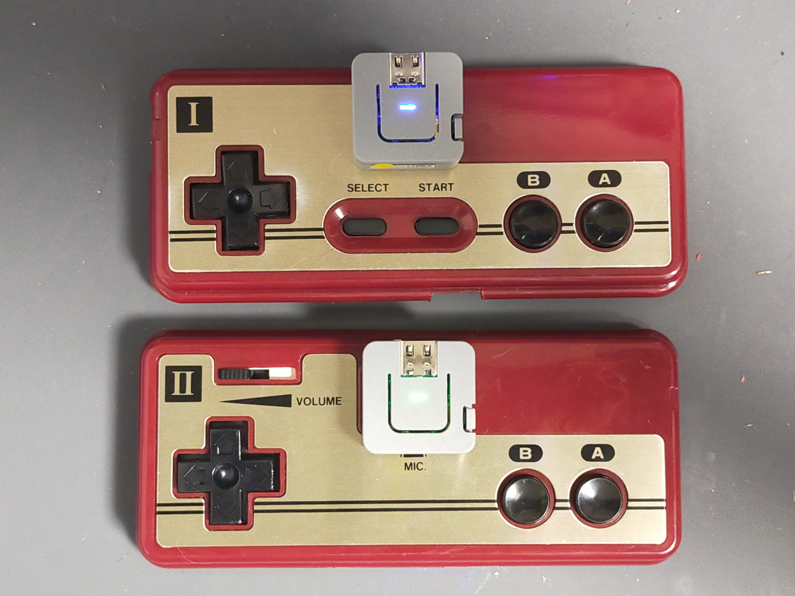
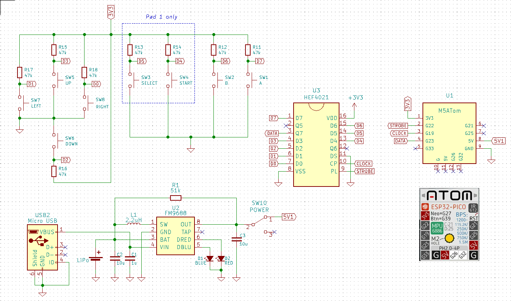
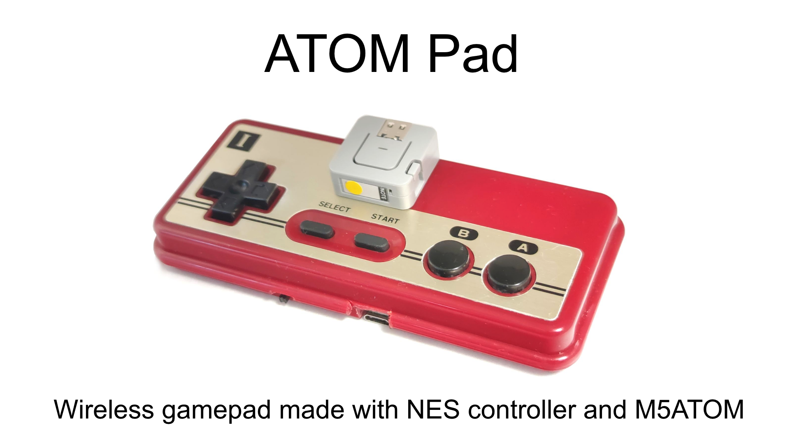

# M5AtomPad
Wireless Contorol Pad of Famicon(NES) using M5Atom

## Schematic

## movie

## NESPad Library for Arduino
https://code.google.com/archive/p/nespad/downloads

https://github.com/joshmarinacci/nespad-arduino (Fork)
